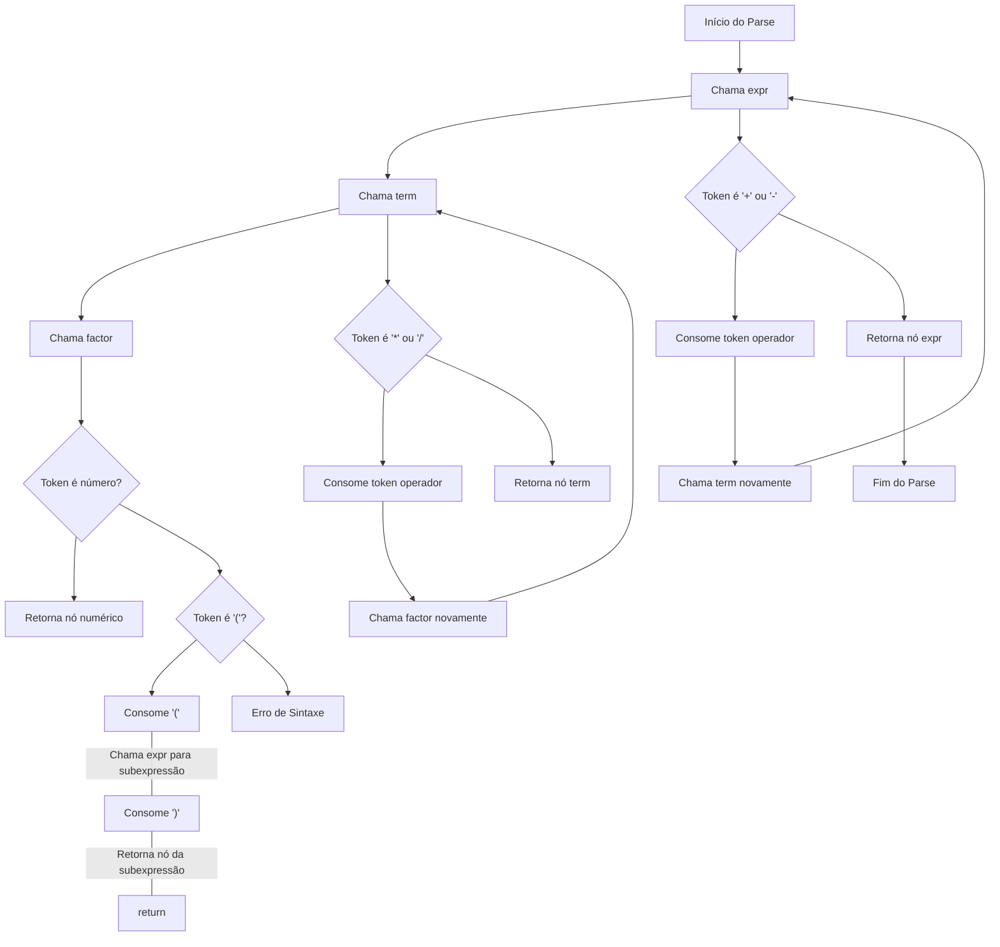

# Interpretador Simples de Matemática

## Descrição

Este projeto é um interpretador simples de matemática que analisa expressões matemáticas aritméticas e as avalia. O interpretador é escrito em Python e utiliza um parser recursivo para interpretar expressões matemáticas envolvendo adição, subtração, multiplicação, divisão e parênteses.

O objetivo deste projeto é praticar conceitos fundamentais de parsing e interpretação de expressões matemáticas. É um exemplo educacional de como construir um interpretador básico para operações matemáticas.

## Funcionalidades

- **Análise de Expressões**: Suporta operações básicas de adição, subtração, multiplicação e divisão.
- **Parênteses**: Suporte a expressões agrupadas usando parênteses.
- **Erros de Sintaxe**: Detecção e relatórios de erros de sintaxe para entradas inválidas.

## Arquitetura

O interpretador é composto por três principais componentes:

- **Scanner**: Divide a entrada em tokens.
- **Parser**: Analisa a sequência de tokens e constrói uma árvore de expressão.
- **Avaliação**: Avalia a árvore de expressão para calcular o resultado final.

### Estrutura do Código

- **`scanner.py`**: Contém a implementação do scanner que divide o texto em tokens.
- **`parser.py`**: Contém a implementação do parser e da avaliação das expressões.
- **`tests.py`**: Contém um exemplo de uso para verificar o funcionamento do interpretador.

# Diagrama do Parser



## Exemplo de Uso

Para utilizar o interpretador, você pode executar o script Python com uma expressão matemática como entrada. Aqui está um exemplo de uso:

```python
# tests.py
from scanner import Scanner
from parser import Parser

def main(expression):
    scanner = Scanner(expression)
    tokens = scanner.tokenize()
    parser = Parser(tokens)
    ast = parser.parse()
    print(ast)

if __name__ == "__main__":
    expression = "3 + 5 * (2 - 8)"
    main(expression)
```

## Instalação

Clone este repositório para o seu ambiente local:

```bash
git clone https://github.com/moiz4rt/interpretador-simples-matematica.git
cd interpretador-simples-matematica
```

Certifique-se de ter o Python instalado em seu sistema. Não há dependências externas para instalar para este projeto específico.

## Contribuições

Contribuições são bem-vindas! Se você encontrar um bug ou deseja adicionar novos recursos, sinta-se à vontade para abrir uma issue ou enviar um pull request.

## Licença

Este projeto é licenciado sob a MIT License.

## Autor

Moisés Cristiano - [moiz4rt](https://github.com/moiz4rt/interpretador-simples-matematica.git) 
